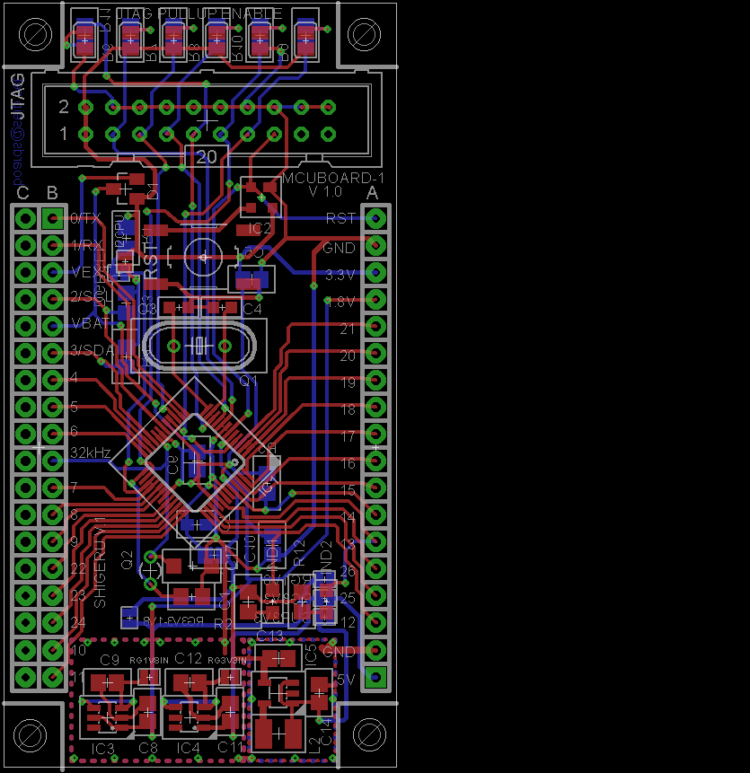
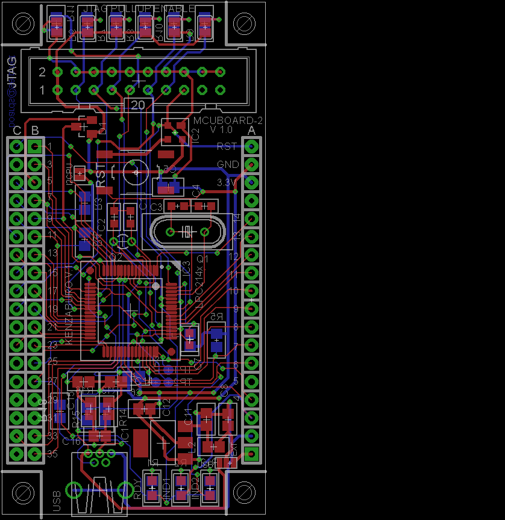
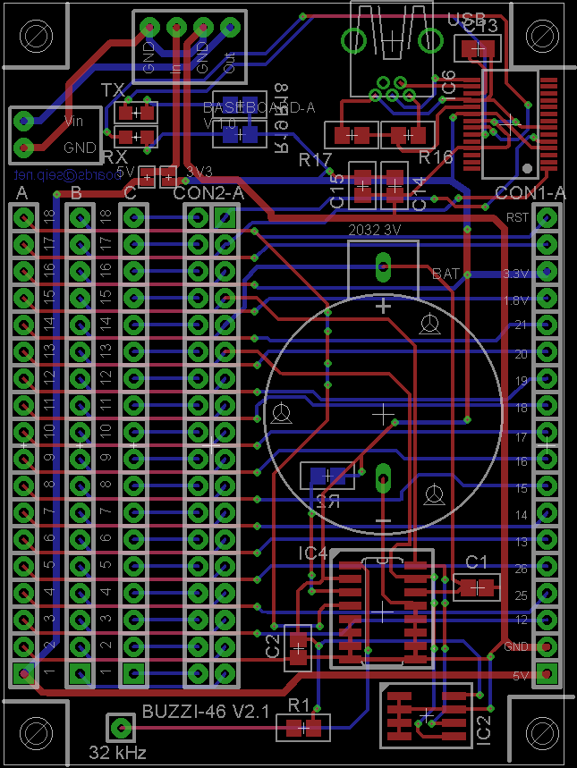
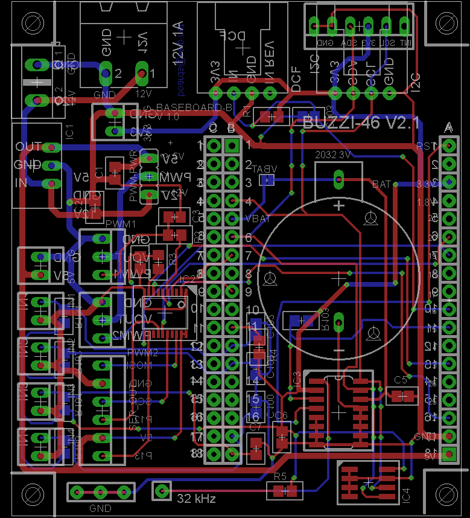

###ARM boards

A set of boards for the Philips ARM-Microcontrollers LPC2101 / LPC2103 and LPC2148.

The MCU boards plug into a motherboard containg connectors and additional hardware for sepcific purposes.

Made with CadSoft Eagle.

Both MCU boards have a JTAG connector, Reset switch, two power MAX8881 linear regulators for 1.8 and 3.3V as well as an optional step-up switching regulator for usage of external voltage below 3.3V

###MCUBOARD-1 "Shigeru" for LPC2103

[Schematic](Images/MCUBOARD-1-V.1.0.sch.png)

###MCUBOARD-2 "Kenzaburo" for LPC2148

[Schematic page 1](Images/MCUBOARD-2-V.1.0.sch.png)

[Schematic page 2](Images/MCUBOARD-2-V.1.0.sch-2.png)

[Schematic page 3](Images/MCUBOARD-2-V.1.0.sch-3.png)

###BASEBOARD-1 General purpose

Contains a DS3231 High-Precision RTC, 2416 EEPROM, FT232 SERIAL USB

[Schematic page 1](Images/BASEBOARD-1-V.1.0.sch.png)

[Schematic page 2](Images/BASEBOARD-1-V.1.0.sch-2.png)

###BASEBOARD-2 Clock

Contains a DS3231 High-Precision RTC, 2416 EEPROM, two 74241 Bus Drivers, 
Additional connectors for I2C, time signal receiver and some buttons.

[Schematic page 1](Images/BASEBOARD-2-V.1.0.sch.png)

###License

[BSD](LICENSE-BSD.txt) for software

[Creative Commons 4.0](LICENSE-CC.txt) for pcb and other artwork

###Copyright

Copyright (c) 2009 Bjoern Seip

